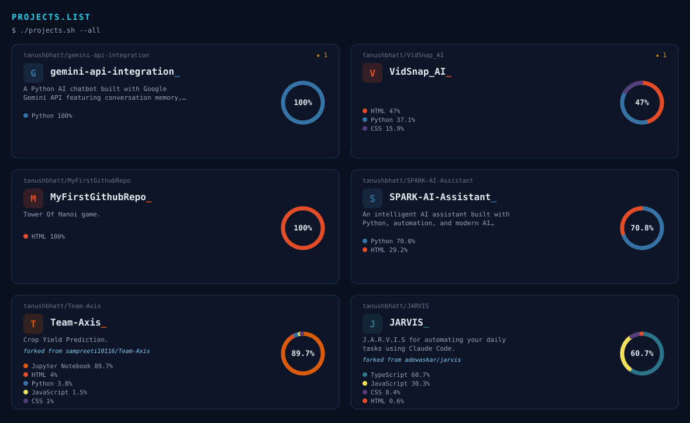

<picture>
  <source media="(prefers-color-scheme: dark)" srcset="assets/dark.svg">
  <source media="(prefers-color-scheme: light)" srcset="assets/light.svg">
  
</picture>

 

<!-- ============== STREAK ============== -->

<!-- ============== STATS + TOP LANGUAGES (matched heights) ============== -->
<picture>
  <source media="(prefers-color-scheme: dark)" srcset="https://github-readme-stats-jade-one-93.vercel.app/api?username=tanushbhatt&show_icons=true&theme=dark&hide_border=true&hide_rank=true">
  <source media="(prefers-color-scheme: light)" srcset="https://github-readme-stats-jade-one-93.vercel.app/api?username=tanushbhatt&show_icons=true&theme=default&hide_border=true&hide_rank=true">
  
</picture>
<picture>
  <source media="(prefers-color-scheme: dark)" srcset="https://github-readme-stats-jade-one-93.vercel.app/api/top-langs/?username=tanushbhatt&theme=dark&hide_border=true&langs_count=8">
  <source media="(prefers-color-scheme: light)" srcset="https://github-readme-stats-jade-one-93.vercel.app/api/top-langs/?username=tanushbhatt&theme=default&hide_border=true&langs_count=8">
  
</picture>

<!-- ============== CONTRIBUTION SNAKE (themed palette) ============== -->
<picture>
  <source media="(prefers-color-scheme: dark)" srcset="https://raw.githubusercontent.com/tanushbhatt/tanushbhatt/output/snake-dark.svg">
  <source media="(prefers-color-scheme: light)" srcset="https://raw.githubusercontent.com/tanushbhatt/tanushbhatt/output/snake-light.svg">
  
</picture>

<!-- ============== PROJECTS ============== -->
<picture>
  <source media="(prefers-color-scheme: dark)" srcset="assets/projects-dark.svg">
  <source media="(prefers-color-scheme: light)" srcset="assets/projects-light.svg">
  
</picture>

**Repo links:** [gemini-api-integration](https://github.com/tanushbhatt/gemini-api-integration) · [VidSnap_AI](https://github.com/tanushbhatt/VidSnap_AI) · [MyFirstGithubRepo](https://github.com/tanushbhatt/MyFirstGithubRepo) · [SPARK-AI-Assistant](https://github.com/tanushbhatt/SPARK-AI-Assistant) · [Team-Axis](https://github.com/tanushbhatt/Team-Axis) · [JARVIS](https://github.com/tanushbhatt/JARVIS)

 

&nbsp;&nbsp;

