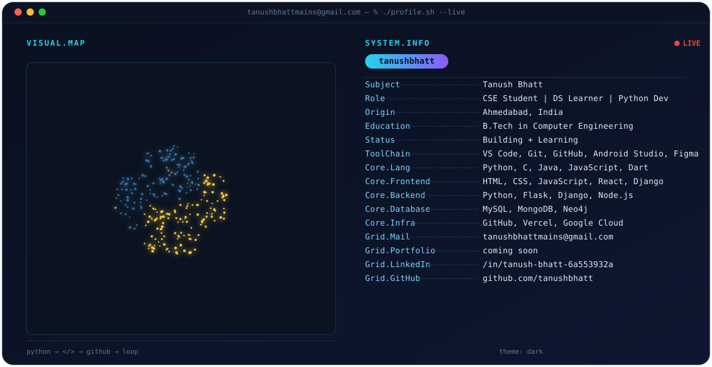

<picture>
  <source media="(prefers-color-scheme: dark)" srcset="assets/dark.svg">
  <source media="(prefers-color-scheme: light)" srcset="assets/light.svg">
  
</picture>

 

<!-- ============== STREAK ============== -->
<picture>
  <source media="(prefers-color-scheme: dark)" srcset="https://YOUR-STATS-INSTANCE.vercel.app/?user=tanushbhatt&theme=dark&hide_border=true">
  <source media="(prefers-color-scheme: light)" srcset="https://YOUR-STATS-INSTANCE.vercel.app/?user=tanushbhatt&theme=default&hide_border=true">
  
</picture>

<!-- ============== STATS + TOP LANGUAGES ============== -->
<picture>
  <source media="(prefers-color-scheme: dark)" srcset="https://YOUR-STATS-INSTANCE.vercel.app/api?username=tanushbhatt&show_icons=true&theme=dark&hide_border=true&hide_rank=true">
  <source media="(prefers-color-scheme: light)" srcset="https://YOUR-STATS-INSTANCE.vercel.app/api?username=tanushbhatt&show_icons=true&theme=default&hide_border=true&hide_rank=true">
  
</picture>
<picture>
  <source media="(prefers-color-scheme: dark)" srcset="https://YOUR-STATS-INSTANCE.vercel.app/api/top-langs/?username=tanushbhatt&layout=compact&theme=dark&hide_border=true">
  <source media="(prefers-color-scheme: light)" srcset="https://YOUR-STATS-INSTANCE.vercel.app/api/top-langs/?username=tanushbhatt&layout=compact&theme=default&hide_border=true">
  
</picture>

<!-- ============== CONTRIBUTION SNAKE ============== -->
<picture>
  <source media="(prefers-color-scheme: dark)" srcset="https://raw.githubusercontent.com/tanushbhatt/tanushbhatt/output/snake-dark.svg">
  <source media="(prefers-color-scheme: light)" srcset="https://raw.githubusercontent.com/tanushbhatt/tanushbhatt/output/snake-light.svg">
  
</picture>

 

## `./projects.sh --all`

<table>
<tr>
<td width="50%" valign="top">

### 🟦 [gemini-api-integration](https://github.com/tanushbhatt/gemini-api-integration)
A Python AI chatbot built with the Google Gemini API, featuring conversation memory, MongoDB integration, chat management, and export functionality.
`Python` · ⭐ 1

</td>
<td width="50%" valign="top">

### 🟦 [tanushbhatt](https://github.com/tanushbhatt/tanushbhatt)
This profile's own source repository.
`Python` · ⭐ 1

</td>
</tr>
<tr>
<td width="50%" valign="top">

### 🟧 [VidSnap_AI](https://github.com/tanushbhatt/VidSnap_AI)
`HTML` · ⭐ 1

</td>
<td width="50%" valign="top">

### 🟧 [MyFirstGithubRepo](https://github.com/tanushbhatt/MyFirstGithubRepo)
Tower Of Hanoi game.
`HTML`

</td>
</tr>
<tr>
<td width="50%" valign="top">

### 🟦 [SPARK-AI-Assistant](https://github.com/tanushbhatt/SPARK-AI-Assistant)
An intelligent AI assistant built with Python, automation, and modern AI technologies.
`Python`

</td>
<td width="50%" valign="top">

### 🟨 [Team-Axis](https://github.com/tanushbhatt/Team-Axis)
Crop Yield Prediction. *(forked from sampreeti10116/Team-Axis)*
`Jupyter Notebook`

</td>
</tr>
</table>

 

&nbsp;&nbsp;

